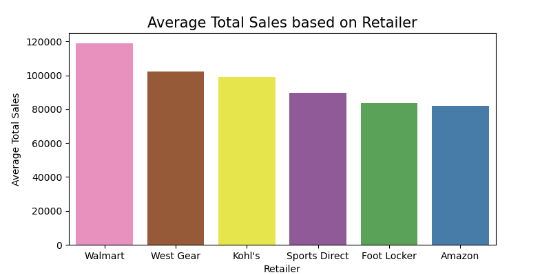
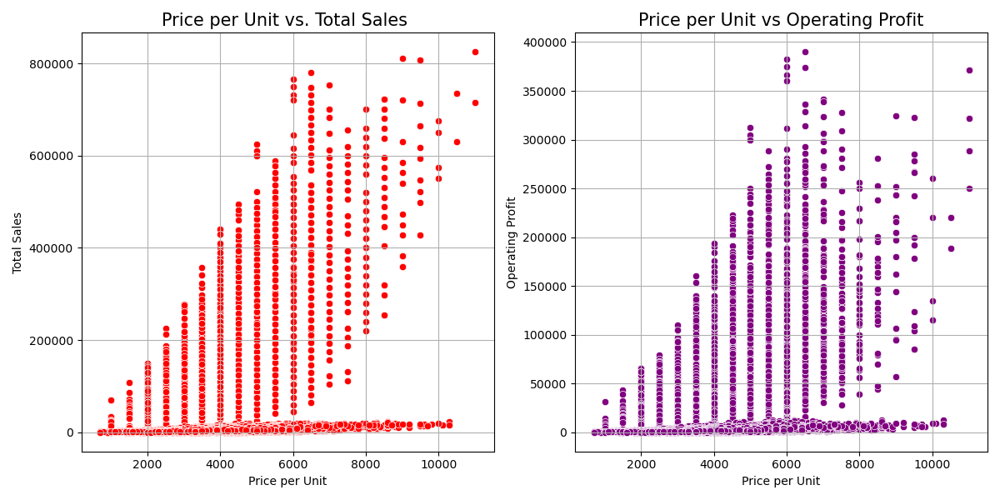
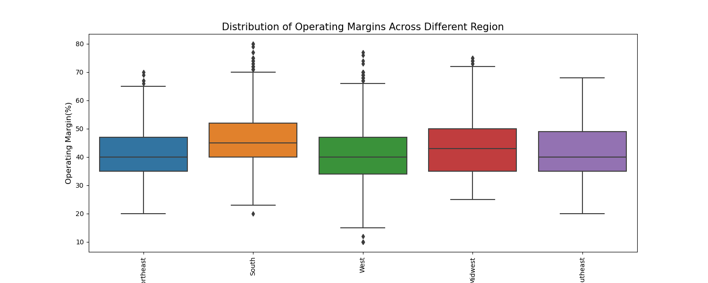
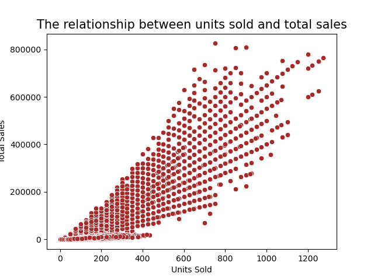

# Analyzing Adidas Sales Performance in the US: A 2020-2021 Overview.
### Introduction
* Adidas is a German athletic apparel and footwear corporation headquartered in Herzogenaurach, Bavaria, Germany. It is the largest sportswear manufacturer in Europe, and the second largest in the world.
### Source of dataset
* We collected the data from [kaggle.com](https://www.kaggle.com/datasets/heemalichaudhari/adidas-sales-dataset) .  
### About the dataset
* This dataset is a collection of data that includes information on the sales of Adidas products in 2020 to 2021.
* Dataset contains 13 columns namely - Retailer,Retailer ID,Invoice Date,Region,State,City,Product,Price per Unit,Units Sold,Total Sales,Operating   Profit,Operating Margin,Sales Method.
### Libraries used
* pandas
* numpy
* matplotlib
* seaborn
### Overview of the features
* Retailer: Name of the retailer.
* Retailer ID: Unique identifier for each retailer.
* Invoice Date: Date when the invoice was issued.
* Region: Geographic region where the sale occurred.
* State: State where the sale occurred.
* City: City where the sale occurred.
* Product: Name of the product sold.
* Price per Unit: The price of one unit of the product.
* Units Sold: The number of units of the product sold.
* Total Sales: The total sales amount for the transaction (Price per Unit * Units Sold).
* Operating Profit: The profit generated from the sale after deducting operating expenses.
* Operating Margin: The operating profit as a percentage of total sales (Operating Profit / Total Sales).
* Sales Method: The method used to make the sale.

## Exploratory Data Analysis
#### How does the total sales revenue vary by retailer?
  

* From the above graph, we can observe that Walmart retailer has the highest average total sales (around $120,000), while Amazon retailer has the lowest average total sales (around $82,000).  

#### How does the price per unit impact total sales and operating profit?

* From the above two graphs, we can see that there is a moderate positive correlation between 'Price per Unit' and 'Total Sales', as well as between 'Operating Profit' and 'Price per Unit'. This means that as the price per unit increases, total sales and operating profit also increase, but the relationships are not extremely strong .
  
#### What is the distribution of operating margins across different Region?

* The graph above shows the distribution of operating margins across different regions. The South region has the highest average operating margin, around 47%, while the West region has the lowest average operating margin, around 40%. Additionally, we can observe that the South and West regions have the maximum number of outliers.
  
#### What is the relationship between units sold and total sales?

* From the above graph, we can see a high positive correlation between total sales and units sold. This indicates that total sales increase as the number of units sold increases.
